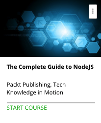

```
Roberto Nogueira  
BSd EE, MSd CE
Solution Integrator Experienced - Certified by Ericsson
```
# The Complete Guide to Nodejs



**About This Course**

Learn everything you need to about Node.js.

[Homepage](https://www.udemy.com/the-complete-guide-to-nodejs/learn/v4/)
## Topics
```
Section: 1
Using Node.js and npm
[x] 1. The Course Overview 2:30
[x] 2. Installing Node.js 7:05
[x] 3. Node.js REPL 5:24
[x] 4. Node.js is JavaScript 7:00
[x] 5. Installing a Package with npm 6:57

Section: 2
Using the Node.js Module System
[x] 6. require() 9:53
[ ] 7. Module Exports 9:03
[ ] 8. Package.json Walkthrough 5:33
[ ] 9. Using package.json to Manage Dependencies 7:17
[ ] 10. Using npm run 6:50
[ ] 11. Creating Our Own Package 7:20

Section: 3
Useful Node.js Paradigms
[ ] 12. Node.js is Asynchronous 7:06
[ ] 13. The Event Loop 7:52
[ ] 14. Callback Pattern 7:54
[ ] 15. Promises Instead of Callbacks 8:32
[ ] 16. Error Handling 6:56

Section: 4
Node.js Events
[ ] 17. Event Emitters 4:24
[ ] 18. Adding and Removing Events 9:41
[ ] 19. Creating Our Own Event Emitter 5:36

Section: 5
Node.js Streams
[ ] 20. Everything is a Stream 5:38
[ ] 21. Readable Streams 6:29
[ ] 22. Writable Streams 6:14
[ ] 23. Network Streams 5:17
[ ] 24. Piping Streams 10:58

Section: 6
Node.js HTTP Server
[ ] 25. The Node.js HTTP Server 6:22
[ ] 26. Making Client Requests 6:04
[ ] 27. Handling Requests 9:40
[ ] 28. Handling Responses 8:45

Section: 7
Node.js and Express
[ ] 29. Installing Express 6:03
[ ] 30. Routing Basics 13:55
[ ] 31. Middleware Basics 10:30
[ ] 32. Handling Errors 6:47
[ ] 33. Debugging in Express 8:37
[ ] 34. Templating in Express 10:25

Section: 8
Passport in Express
[ ] 35. Creating a Protected Page 10:26
[ ] 36. Creating a Login Page 7:01
[ ] 37. Passport and Authentication 9:32
[ ] 38. Where to Go from Here 5:50
```
